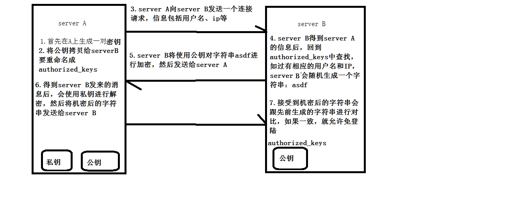

### 基本命令2

#### 1. SSH 免密登录



ssh:一种协议标准，与其他协议telnet,ftp等相比，ssh优势在于安全远程登录

openssh:是ssh安全远程登录的开源实现（软件）

使用openssh软件实现 hdp01登录到hdp02

```shell
# 全部安装ssh客户端
yum -y install openssh-cilents
# 生成公钥私钥
ssh-keygen -t rsa -P '' -f ~/.ssh/id_rsa
# -t 加密算法 -P 私钥是否使用密码 -f 密钥保存位置
ssh-copy-id hostname
# 将公钥copy到hostname的主机上
# 上述过程*3 使得n台主机能够免密登录
```


#### 2. 数据处理-高级文本处理

####2.1 cut 文本选取命令

```shell 
cut [-nb] [file] b:byte
cut [-c] [file] c:char
cut [-df] [file] f:files
使用说明：# 每一行操作 缺点：只支持单字符
cut 命令从文件中的每一行剪切字节，字符，字段，并将其输出到标准输出
如果不指定file参数，cut命令将读取标准输入
# 必须指定 -b -c -f 中的一种
参数含义：
-d # 表示指定自定义分隔符，默认是\t 制表符，与-f一起使用
-f # 依据-d分割字段，将一段信息分割成多段，用-f表示取出第几段
-c # 以字符为单位，取出固定的字符区间
-b # 以字节为单位，取出固定的字节区间，这些字节位置将忽略多字节边界（即只管读取字节而不是完整字符），除非与-n一起使用
-n # 由于汉字等编码问题，当字符的最后一个字节落在cut区间内时，获取当前字符，否则，抛弃该字符
eg：
中  国
123 456
cut -nb 2-5 中
who | cut -b 1,4
who | cut -b -3,2-
cut 使用-b选项命令时，不会颠倒数据的位置，且不会重复(自动去重)。
cat /etc/passwd | cut -d ":" -f 1 # 获取所有的用户名
set -i "1d" xxx
```

#### 2.2 awk 命令

#####2.2.1 命令行

```shell
awk [-F fields -separator] 'command' file
awk + 分隔符 + 处理的逻辑 + 文件
awk -F ':' action 文件
```

##### 2.2.2 shell 脚本方式

将所有awk命令写入一个文件，并使这个文件可执行，然后awk命令解析器作为脚本的首行，来告知通过awk调用，相当于shell脚本中的 #bin/bash 可以将所有awk命令插入一个单独的文件，然后调用awk -f 调用脚本文件

```shell
awk -f awk.sh /etc/passwd
# -f 后面接的是要加载或要执行的awk脚本文件
last -5 | awk '{print $1}' # 默认空格分隔符
cat /etc/passwd | awk -F ':' '{print $1 "\t" $7}' # 打印第一和第七 \t分割 账户	账户对应的shell
cat /etc/passwd | awk -F ':' 'BEGIN {print "name,shell"}  {print $1"\t"$7}  END {print "blue,bin/bash"}'
# awk逻辑：
awk -F 分隔符 'BEGIN{}  action{}  END{}'
# 搜索
awk -F ':' '/root/{print $1 "," $2}' /etc/passwd
# awk 内置变量
ARGC 		命令行参数的个数
ARGV 		命令行参数排列
FILENAME 	awk浏览的文件名
FNR 		浏览文件的记录数据
NR 			已读的记录数
NF			浏览的记录的域的个数
OFS			输出域的分隔符
ORS			输出记录的分隔符
RS 			控制记录分隔符
$1 第一个域 
$0 这一行的全部数据
统计/etc/passwd
文件名   行号 列数 对应该行内容
FILENAME NR   NF  $0
awk -F ':' 'BEGIN{print "begin"} {print "1:" NR ,"2:" NF,"3:",$0} END{print "end filename:" FILENAME}' /etc/passwd # 不能放在BEGIN 因为没有读文件
# awk自定义变量 begin end课单独存在
awk '{count++; print $0;} END{print "user count is:"count}' /etc/passwd
awk 'BEGIN{count=0}  {count++; print $0;} END{print "user count is:"count}' /etc/passwd
nl /etc/passwd # 查看 打印行
# 统计一个文件夹下的文件占用的字节数
ls -l | awk -F " " 'BEGIN{size=0} {size = size+$5} END{print size}'
# 统计centos下所有文件的大小 -R 递归文件夹显示
ll -R /mnt/centos | awk -F " " 'BEGIN{size=0} {size = size+$5} END{print size/1024/1024/1024"G"}'
```


  #### 3. crontab 以及 时间同步ntp配置

##### 3.1 crontab 定时任务

通过crontab，可以定时的，固定时间间隔的执行指定的任务

shell脚本，也可以是一些系统指令

间隔单位：分钟 小时 日  月  周

根据 分钟 小时 日  月  周的任意组合

这个命令适合周期性的数据获取与备份

```shell
# 服务的安装
yum -y isntall cron
# 服务的管理
service crond [start/stop/restart/reload/status]
crontab [-u user] file
crontab [-u user] [-e|-l|-r]
# 参数：
-u user # 用来设置某用户的crontab服务
file # 是命令文件的名字，表示该文件作为crontab的任务列表并载入crontab中
-e # 编辑某个用户的crontab任务。如果不指定用户，会编辑当前用户的crontab任务
-l # list 列举某个用户的crontab任务
-r # 删除某个用户的crontab任务
crontab -l
crontab -u root -e # 编辑root用户的定时任务
# 命令模式
*　　*　　*　　*　　*　　command 
分　 时　 日　 月　 周　 命令 
第1列表示分钟1～59 每分钟用*或者 */1表示 
第2列表示小时0～23（0表示0点） 
第3列表示日期1～31 
第4列表示月份1～12 
第5列标识号星期0～6（0表示星期天） 
第6列要运行的命令 
crontab文件的一些例子： 
30 21 * * * /usr/local/etc/rc.d/lighttpd restart 
上面的例子表示每晚的21:30重启apache。
* */1 * * * /usr/local/etc/rc.d/lighttpd restart 
每一小时重启apache 
```

##### 3.2 ntp 时间同步

步骤：

1.时间服务器

2.所有机器与时间服务器的时间同步

NTP服务：用来使计算机时间同步的一种协议

```shell
# 服务器端安装服务
yum -y install ntp
# 服务器端配置conf
vi /etc/ntp.conf

# Hosts on local network are less restricted.
#restrict 192.168.1.0 mask 255.255.255.0 nomodify notrap
restrict 192.168.128.0 mask 255.255.255.0 nomodify notrap # 改这一行 改网关

# Use public servers from the pool.ntp.org project.
# Please consider joining the pool (http://www.pool.ntp.org/join.html).
#server 0.centos.pool.ntp.org iburst
#server 1.centos.pool.ntp.org iburst
#server 2.centos.pool.ntp.org iburst
#server 3.centos.pool.ntp.org iburst
server 127.127.1.0 # 改这一行

# 服务器端重启服务
service htpd restart

# 客户端安装ntpdate
yum -y install ntpdate
# 客户端添加定时任务
crontab -e
* */1 * * * /usr/sbin/ntpdate hdp01 >> /root/datelog.log # 打印日志到.log
```

